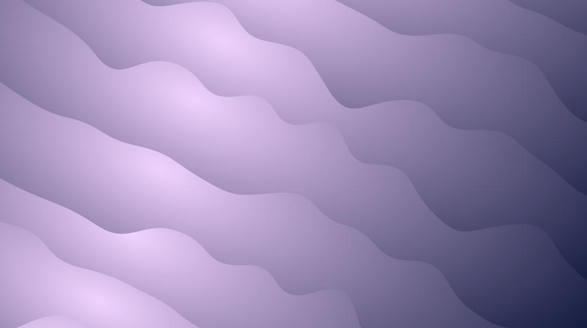

# Waves animation

Wave patterns that slowly moves upwards over the screen

## Goal
The goal is to replicate the background video effect from the [All Ears website](https://sv.allears.ai/).

The solution currently uses HTML, CSS, SVG for curves, and [AnimeJS](https://github.com/juliangarnier/anime) for transitions.

## Issues
The animation is quite CPU intesive. A solution might be to only use CSS transitions instead of AnimeJS.

## How to run
Download waves.html and open it in the browser.